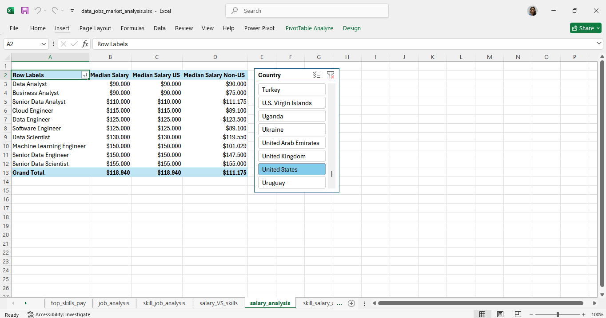
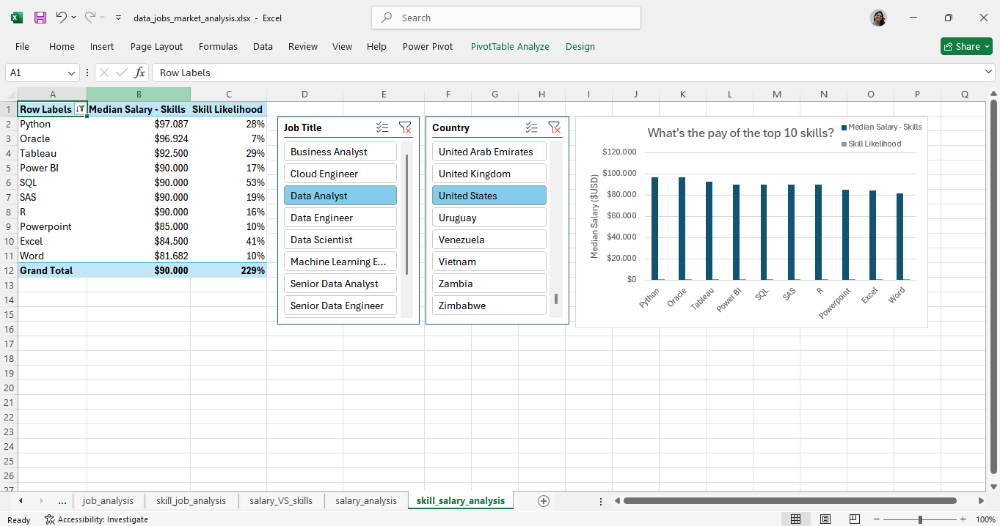
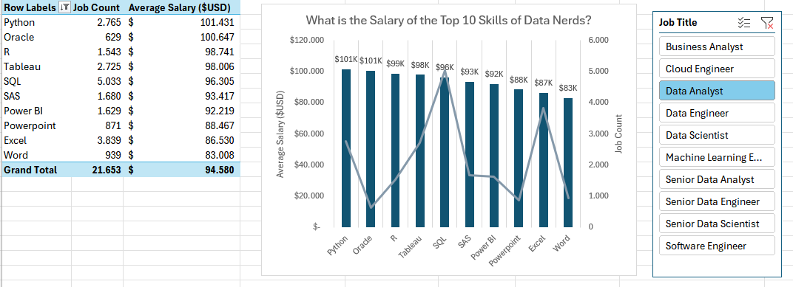

# Data Jobs Market Analysis

## 📌 Overview

This project analyzes the data job market using Microsoft Excel, with a focus on salaries, job roles, required skills, and geographic differences.

The goal of the project is to explore job market data and identify patterns that can help professionals better understand salary trends, skill demand, and the relationship between technical skills and compensation across data-related roles.

## 🎯 Questions Explored

The analysis investigates questions such as:

- How do median salaries vary across data-related roles?
- How do salaries compare between U.S. and non-U.S. positions?
- Which skills are most frequently requested for Data Analyst roles?
- Which skills are associated with higher median salaries?
- Is there a relationship between the number of skills required and salary?
- How do skill requirements differ across data-related roles?

## 🔎 Analysis

### Salary by Job Role

Median salaries were compared across different data-related positions to identify differences in compensation between roles.

### Salary by Location

The project compares salary levels between U.S. and non-U.S. positions, providing a geographic perspective on compensation.

### Skills Demand

The analysis explores the frequency of technical skills requested for Data Analyst positions, including:

- SQL
- Excel
- Python
- Tableau
- Power BI
- R
- SAS

### Skills and Salary

Skill demand was compared with median salary to explore which technical skills are associated with different compensation levels.

### Number of Skills

The project also explores the relationship between the number of skills associated with data roles and their median salaries.

## 📈 Key Insights

### Salary by Role and Location

Median salaries vary considerably across data-related roles. In the analyzed dataset, Data Analyst positions have a median salary of **$90,000**, while more specialized and senior roles show higher median compensation.

The analysis also allows comparison between U.S. and non-U.S. salaries using an interactive country filter.

### Skill Demand vs. Median Salary

For Data Analyst positions in the United States, **SQL** is the most frequently requested skill among the top skills analyzed, with a **53% skill likelihood**.

Other frequently requested skills include **Excel (41%)**, **Tableau (29%)**, **Python (28%)**, **SAS (19%)**, **Power BI (17%)**, and **R (16%)**.

Among these skills, **Python** is associated with the highest median salary at approximately **$97,087**, followed by **Oracle ($96,924)** and **Tableau ($92,500)**.

This comparison highlights that the most frequently requested skills are not necessarily associated with the highest median salaries.

### Skills, Salary, and Job Count

The analysis also compares average salary with the number of job postings associated with each skill.

For the selected Data Analyst view, **SQL** has the highest job count among the top skills analyzed, while **Python** combines relatively high job availability with one of the highest average salaries.

## 🛠 Tools & Techniques

- Microsoft Excel
- Power Query
- Power Pivot
- PivotTables
- Data Model
- Data Cleaning
- Data Analysis
- Data Visualization

## 📁 Project File

The complete Excel workbook containing the analysis is available in this repository:

[`data_jobs_market_analysis.xlsx`](./data_jobs_market_analysis.xlsx)

> **Note:** This workbook uses Power Query, Power Pivot, and Excel Data Model features. For full functionality, download the file and open it in the desktop version of Microsoft Excel. Some features may not be fully supported in Excel for the web.

## 👩‍💻 About This Project

This project is part of my data analytics portfolio and demonstrates my ability to explore datasets, formulate analytical questions, identify patterns, and communicate findings using Microsoft Excel.

It also reflects my ongoing development in data analytics, building on my background in healthcare research, statistical analysis, and biostatistics.
