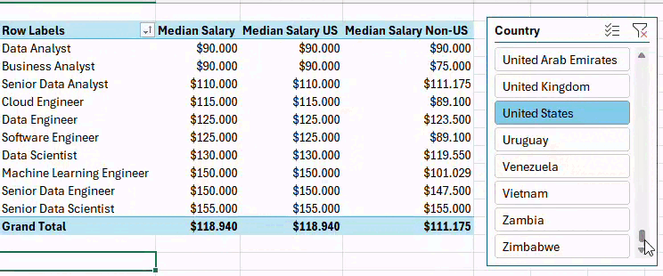
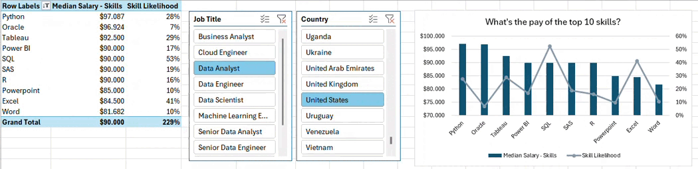
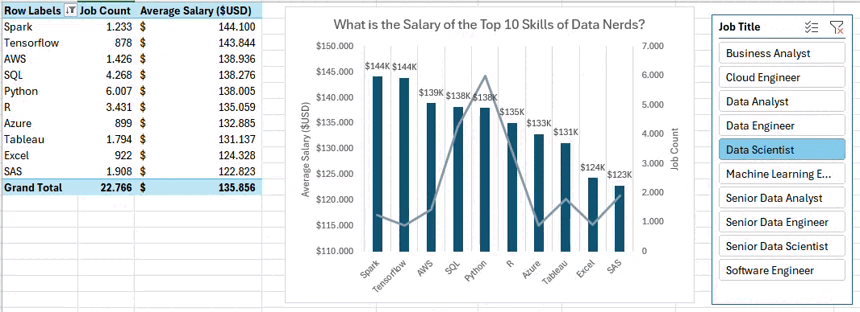

# Data Jobs Market Analysis

## 📌 Overview

This project analyzes the data job market using Microsoft Excel, with a focus on salaries, job roles, technical skills, job demand, and geographic differences.

The goal is to explore patterns in the data job market and understand how compensation and skill demand vary across different data-related roles and locations.

The project includes interactive analyses using PivotTables, charts, and slicers.

## 🎯 Questions Explored

The analysis investigates questions such as:

- How do median salaries vary across data-related roles?
- How do U.S. and non-U.S. salaries compare?
- Which technical skills are most frequently requested for different data roles?
- Which skills are associated with higher median salaries?
- How does skill demand compare with median salary?
- Which skills combine high job demand with high average salaries?
- How do these patterns change across job titles and countries?

## 🔎 Analysis

### Salary by Job Role and Location

This analysis compares salaries across different data-related job titles using three measures:

- Median Salary
- Median Salary US
- Median Salary Non-US

An interactive **Country** slicer allows salary patterns to be explored across different locations.

In the United States view shown below, median salaries range from **$90,000 for Data Analyst and Business Analyst roles** to **$155,000 for Senior Data Scientist roles**.

### What's the pay of the top 10 skills?

This analysis explores the relationship between **Median Salary** and **Skill Likelihood** for the top skills associated with a selected job role.

The chart combines:

- Median Salary - Skills
- Skill Likelihood

Separate axes allow salary and skill demand to be compared within the same visualization.

The analysis can be filtered interactively by **Job Title** and **Country**.

For **Data Analyst positions in the United States**, SQL has the highest skill likelihood among the displayed skills at **53%**, followed by Excel at **41%**, Tableau at **29%**, and Python at **28%**.

Among the displayed skills, Python has the highest median salary at approximately **$97,087**, followed by Oracle at **$96,924** and Tableau at **$92,500**.

This comparison shows that the most frequently requested skills are not necessarily associated with the highest median salaries.

### What is the Salary of the Top 10 Skills of Data Nerds?

This analysis compares **Job Count** and **Average Salary (USD)** for the top skills associated with a selected data role.

An interactive **Job Title** slicer allows the analysis to be explored across different data-related positions.

For the **Data Analyst** view shown in the project preview, SQL has the highest job count among the displayed skills with **5,033 jobs**, followed by Excel with **3,839** and Python with **2,765**.

Python and Oracle have the highest average salaries among the displayed skills at approximately **$101,431** and **$100,647**, respectively.

The visualization makes it possible to compare job-market demand with average compensation and identify skills that may offer different combinations of demand and salary.

## 📈 Key Insights

- Median salaries vary considerably across data-related roles.
- Specialized and senior data roles generally show higher median salaries in the salary analysis.
- U.S. and non-U.S. salary levels can be compared across multiple job titles.
- Skill demand and salary do not necessarily move together.
- For U.S. Data Analyst positions, SQL has the highest skill likelihood among the displayed skills at **53%**, while Python has the highest median salary at approximately **$97,087**.
- In the Data Analyst job-count analysis, SQL has the highest job count among the displayed skills, while Python and Oracle show the highest average salaries.
- Interactive slicers allow the analyses to be explored across different job titles and locations.

## 🛠 Tools & Techniques

- Microsoft Excel
- Power Query
- Power Pivot
- PivotTables
- Excel Data Model
- Data Cleaning
- Data Transformation
- Data Modeling
- Data Analysis
- Data Visualization
- Interactive Slicers

## 📁 Project File

The complete Excel workbook containing the analysis is available in this repository:

[`data_jobs_market_analysis.xlsx`](data_jobs_market_analysis.xlsx)

> **Note:** This workbook uses Power Query, Power Pivot, PivotTables, slicers, and Excel Data Model features. For full functionality, download the file and open it in the desktop version of Microsoft Excel. Some features may not be fully supported in Excel for the web.

## 👩‍💻 About This Project

This project is part of my data analytics portfolio and demonstrates my ability to clean and transform data, build data models, create interactive analyses, identify patterns, and communicate findings using Microsoft Excel.

It also reflects my ongoing development in data analytics, building on my background in healthcare research, statistical analysis, and biostatistics.
